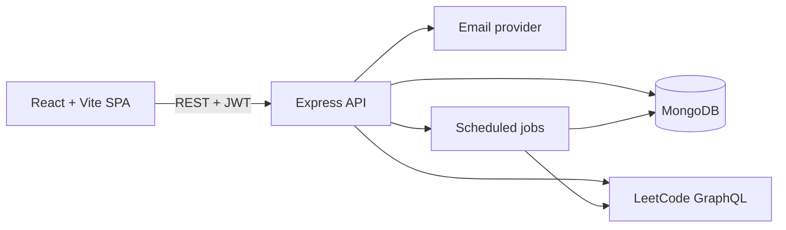

# LeetQuest High-Level Design

## 1. Purpose

LeetQuest is a gamified productivity companion for LeetCode. It does not execute or judge code. Users solve problems on LeetCode, then LeetQuest synchronizes public progress and turns it into XP, levels, streaks, badges, analytics, challenges, and social comparisons.

## 2. Goals and Non-Goals

### Goals

- Make consistent LeetCode practice visible and rewarding.
- Provide a single dashboard for progress, activity, streaks, and consistency.
- Enable lightweight competition through friends, clans, leaderboards, and challenges.
- Provide account verification, password recovery, moderation, and public profiles.

### Non-Goals

- In-app problem solving, code execution, or judging.
- Replacing LeetCode as the problem catalog or source of truth.
- Storing support requests as application content; they are sent by email.

## 3. Architecture

### Components

- **Frontend:** React 18, React Router, Axios, Recharts, Framer Motion, GSAP, and shared page/components. `AuthContext` hydrates auth state from browser storage and Axios attaches the bearer token.
- **API:** Express application with JSON parsing, CORS, health check, route modules, auth middleware, admin middleware, and centralized error handling.
- **Persistence:** MongoDB accessed through Mongoose. User progress is denormalized for fast dashboard reads; activity records preserve recent solved-question events.
- **LeetCode adapter:** Calls LeetCode GraphQL using the configured public username and maps solved counts/submissions into the application model.
- **Gamification services:** XP, level, badge, streak, and consistency calculations are kept in backend services/utilities.
- **Email:** Registration OTP, password reset, and support/feedback messages use the backend email service configuration.
- **Jobs:** Daily sync and streak reset modules exist, but must be registered by the server before they run in production.

## 4. Runtime Flows

### Registration and access

1. User registers with username, email, and password.
2. Password is hashed and an OTP is sent.
3. User verifies the OTP, then logs in.
4. API returns a JWT; protected requests send it as `Authorization: Bearer <token>`.
5. Banned users and unauthorized users are rejected by middleware.

### Synchronization

1. User supplies a public LeetCode username.
2. Frontend requests a sync, including clear-and-resync when applicable.
3. API reads public LeetCode GraphQL data.
4. User solved totals and recent accepted activities are updated.
5. XP, level, badges, streak, consistency score, and `lastSyncedAt` are recalculated.
6. Dashboard and analytics read the stored result, rather than calling LeetCode for every view.

### Social and competition

Users search for other accounts, maintain a friend list, create/join clans, post clan messages, and create or update challenge records. Leaderboard and public profile views read user progress while keeping the solve action on LeetCode.

## 5. Security and Reliability

- Hash passwords with bcrypt and sign sessions with JWT.
- Require email verification before normal account use.
- Protect authenticated and admin routes with middleware.
- Rate-limit authentication endpoints.
- Keep secrets and database credentials in environment variables.
- Use MongoDB indexes/unique constraints for usernames and emails.
- Treat LeetCode and email as failure-prone external dependencies; return actionable errors and avoid partially updating user progress.
- Configure restricted CORS, HTTPS, request validation, structured logging, and secret rotation for production.

## 6. Deployment Topology

- Deploy the frontend as a static Vite build behind a CDN or static host.
- Deploy the backend as a long-running Node.js service with network access to MongoDB and external APIs.
- Use a managed MongoDB deployment with backups and monitoring.
- Run scheduled jobs in one controlled worker/instance to avoid duplicate syncs and resets.
- Configure `PORT`, `MONGO_URI`, `JWT_SECRET`, `FRONTEND_URL`, email credentials/API key, and admin seed credentials per environment.

## 7. Observability and Risks

Monitor API latency/error rates, sync success/failure, email delivery, job execution, database health, and authentication failures. Current implementation risks include unrestricted CORS, limited recent-submission history, browser-driven periodic sync, placeholder cron registration, and inconsistent email configuration documentation versus implementation.
